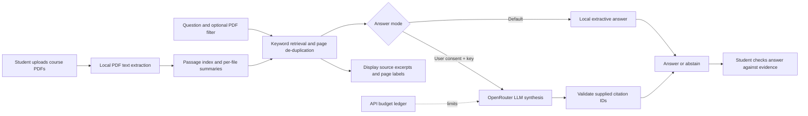

# Product Documentation

## Product in one sentence

The PE6201 Course Materials Q&A Assistant helps a PE6201 student find and understand evidence in course PDFs, then check each answer against the cited file and page.

## Primary persona and problem

**Primary persona:** a PE6201 student revising for assignments or an examination who remembers a concept but not which lecture, exercise, or page explained it. The student needs a fast way to search course material and verify an answer, rather than another general-purpose chatbot.

**Problem statement:** PE6201 material is distributed across lecture notes, exercises, cases, and pre-reads. Keyword search can find matching words but cannot reliably explain a concept or show whether a generated explanation is grounded in the course. This prototype reduces the work of locating candidate passages and makes the evidence visible. It has not yet measured minutes saved or learning gains with students; those outcomes must not be claimed as demonstrated impact.

## Input and output

| Part | Description |
|---|---|
| Input | Text-based course PDFs; a natural-language question; optionally a specific source PDF; optionally explicit consent to send the question and retrieved excerpts to OpenRouter. |
| Processing | PDF text extraction and chunking; local keyword/BM25-style retrieval; source/week filtering; local extractive answer or optional LLM synthesis; citation validation and abstention. |
| Output | A concise answer, source IDs linked to retrieved excerpts, file and page labels, or an abstention when retrieval/model evidence is insufficient. A separate feature creates a short revision quiz from indexed pages. |

## High-level architecture

The default path is local. OpenRouter receives only the question and up to four retrieved excerpts after the user checks the consent box. The original PDFs remain on the local machine. The optional quiz path is separate from question answering.

## Why this design is course-specific

The product is a document-grounded study assistant, not an autonomous tool-using agent. A student asks a question and needs a source-backed explanation; the task does not require the agent to plan and execute a multi-step workflow in external systems. The course-specific value comes from retrieving the student's own PE6201 files, allowing a source filter for lecture versus exercise material, citing pages, and declining unsupported questions. Adding generic tool calls would increase cost and risk without solving the central problem.

## Metrics: targets and observed results

The following acceptance targets were adopted for the project wrap-up; they were not preregistered before development.

| Metric | Project target | Observed result | Interpretation |
|---|---:|---:|---|
| Local test answerability precision | >= 0.85 | 0.88 | Correctly limits some unsupported answers. |
| Local test answerability recall | >= 0.90 | 0.94 | One of 16 answerable test questions was abstained on. |
| Local test evidence page Hit@4 | >= 0.90 | 1.00 | Every answerable test question had a labeled target page in the top four; this does not prove the selected answer sentence is correct. |
| Model cited expected source/page | >= 0.90 | 15/16 = 0.938 | Strict exact-page match from the prior model evaluation snapshot. Other supporting pages can be valid even when they differ from the single gold page. |
| Model reference token F1 | >= 0.50 | 0.548; local baseline 0.224 | Lexical overlap improved, but token F1 is not a semantic correctness score. |
| Project API spend | < US$5 | Local ledger snapshot: US$0.005740 across 53 requests | The app's own request stop is US$4.50; it does not count use of the same account outside this app. |

Model answerability accuracy of 100% means only that the model answered or abstained in line with the binary labels; it does not mean all factual answers were correct. For example, Q020 received a low token F1 of 0.163 because its answer substituted governance for the reference's maintenance-budget point. The 22-question test set remains too small for a broad performance claim.

## Limitations and intended use

- The labeled set contains 68 cases: 46 development and 22 held-out test questions. A single test case changes a percentage noticeably, and questions authored alongside the system may not represent unseen student wording.
- PDF extraction is text-based. Scanned pages, diagrams, tables, and formulas may not be searchable or faithfully represented.
- Local token F1 is only a lexical proxy. Human review is needed to assess semantic answer correctness and whether each citation supports the nearby claim.
- Source PDFs may be subject to course-material restrictions. Include them in a submitted or shared repository only when distribution is permitted; otherwise provide a manifest and instructions for authorized users to upload their copies.
- The application is intended for study and revision. It is not a substitute for course instructions, instructor feedback, or an authoritative answer key.

## Build-versus-buy summary

The project owns PDF ingestion, local storage, course-specific source filtering, retrieval, abstention logic, citation display, quiz selection, evaluation data, and the spend ledger. It rents OpenRouter's hosted model only for an optional answer-synthesis path. Local retrieval and extractive answering form the non-LLM baseline; the model is useful when evidence needs concise synthesis, but it adds external-data, cost, latency, and citation risks.
